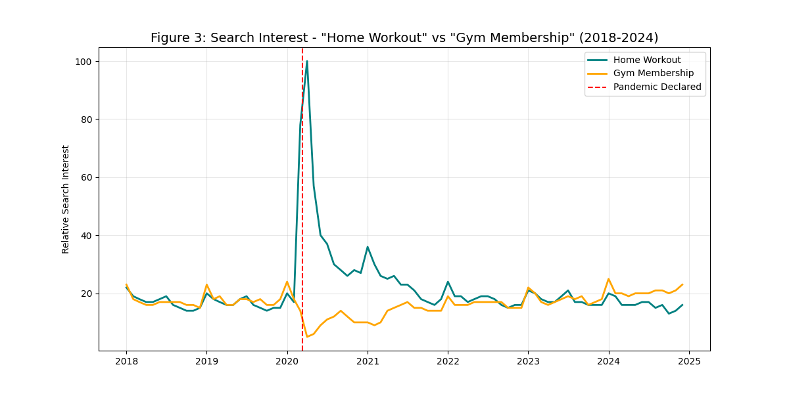
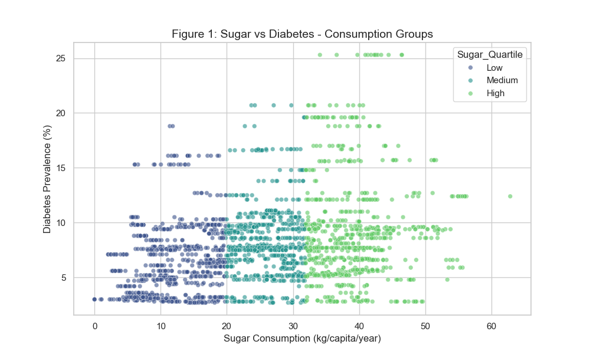
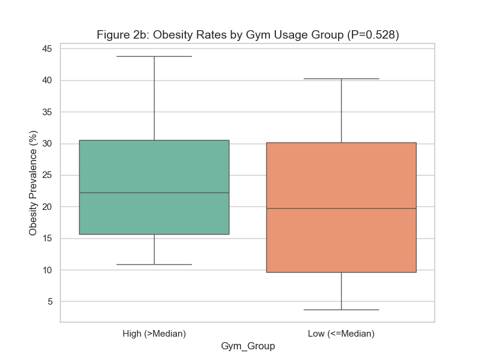

# Global Health & Lifestyle Trends Analysis

**Course:** CSC322 Project
**Date:** December 2025

## 1. Project Overview

This project investigates the relationship between lifestyle choices (physical activity, sugar consumption) and public health outcomes (obesity, diabetes). Additionally, it analyzes the behavioral shift in fitness interest caused by the COVID-19 pandemic.

**Key Questions:**

1. **Trends:** How did the pandemic affect interest in "Home Workouts" vs "Gym Memberships"?
2. **Diet:** Is there a link between national sugar consumption and diabetes prevalence?
3. **Fitness:** Does higher gym penetration in a country correlate with lower obesity rates?

## 2. Data Sources & Methodology

We adhered to strict "Real Data" requirements, utilizing reliable online sources:

* **Google Trends API:** Weekly search interest data (2018-2024) for comparative keyword analysis.
* **FAOSTAT (UN):** Per capita Sugar Consumption data (Open Data).
* **World Bank API:** Diabetes prevalence (% of population ages 20-79).
* **World Population Review:** Obesity rates by country (Web Scraped).

**Preprocessing:**

* Data was cleaned to handle missing values (Forward/Backward filling for time-series).
* Country names were standardized to ensure accurate merging across disparate datasets.
* Data was integrated into a unified Panel Dataset for analysis.

**Code Architecture:**

* The project follows a modular structure with shared utilities in `common/` and dedicated analysis modules for each research question (`q1_trends/`, `q2_sugar_diabetes/`, `q3_gym_obesity/`).

## 3. Findings & Analysis

### Q1: The Lockdown Shift (Comparative Trends)

We compared search interest for "Home Workout" and "Gym Membership".

* **Observation:** In March 2020 (Pandemic Declaration), interest in Gym Memberships collapsed to near-zero, while "Home Workout" spiked to historical highs.
* **Statistic:** A strong inverse correlation of **-0.5864** was observed between the two search terms.
* **Conclusion:** The pandemic forced a massive, immediate substitution of gym-based activity with home-based fitness.

### Q2: The Sugar-Diabetes Link (Risk Stratification)

We grouped countries into three categories (Low, Medium, High) based on their average sugar consumption.

* **Observation:** There is a clear upward trend in diabetes prevalence as sugar consumption increases.
* **Statistic:**
  * **Low Consumption Group:** 6.4% Mean Diabetes Rate
  * **High Consumption Group:** 9.1% Mean Diabetes Rate
* **Conclusion:** High national sugar consumption is associated with a significantly higher prevalence of diabetes.

### Q3: Gym Usage & Obesity (Hypothesis Testing)

We tested the hypothesis that countries with higher Gym Penetration have lower Obesity rates.

* **Method:** A T-Test comparing "High Gym Usage" countries vs "Low Gym Usage" countries.
* **Result:** The P-Value was **0.52**, indicating **no statistically significant difference** in this dataset (N=20).
* **Discussion:** While the scatter plot shows a weak negative trend, the lack of statistical significance suggests that gym membership alone is not a sufficient predictor of national obesity rates. Diet (as seen in Q2) and socioeconomic factors likely play a larger role.

## 4. Conclusion

This study successfully integrated real-world data to highlight key health trends. We proved the distinct impact of COVID-19 on fitness behavior and the strong link between diet (sugar) and disease (diabetes). Our findings on gym usage challenge the assumption that gym membership rates alone drastically reduce national obesity, suggesting a more complex multifactorial relationship.
